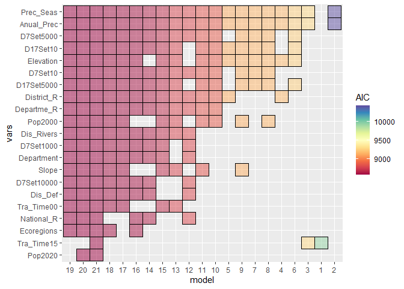
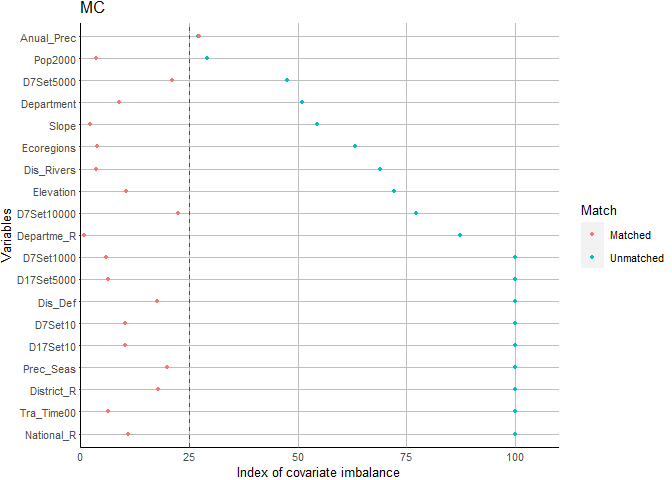
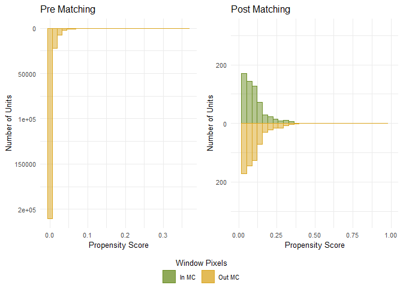
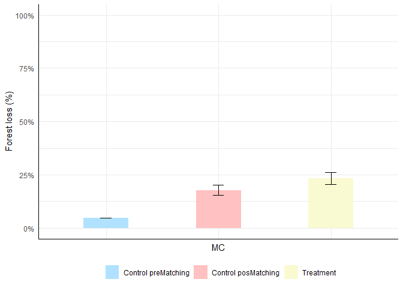
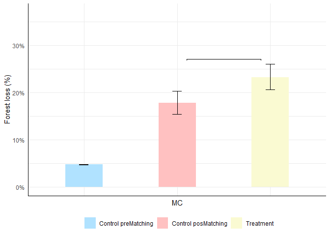
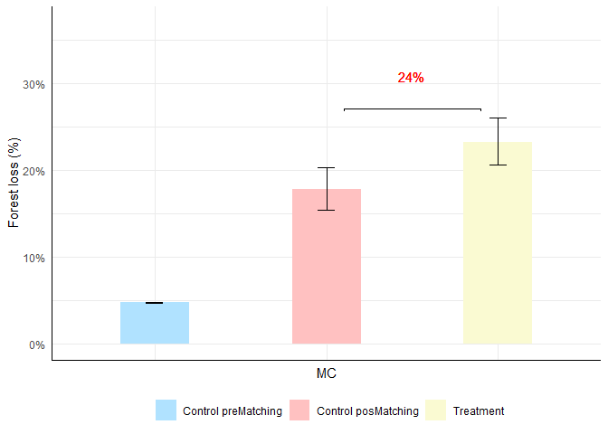
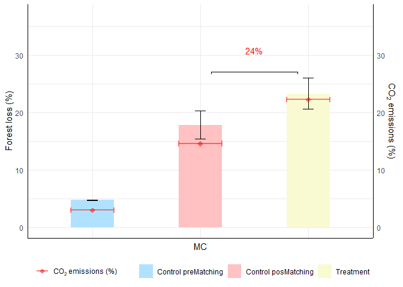
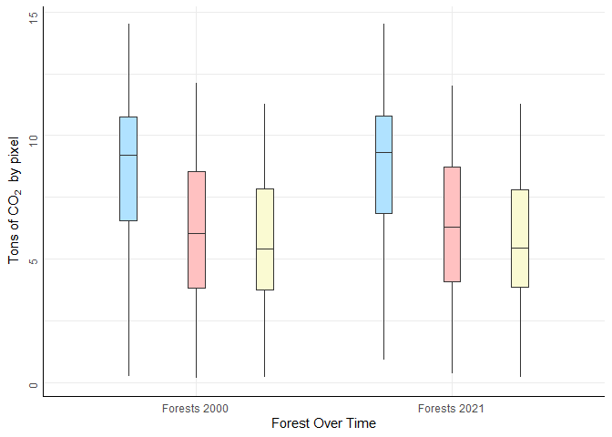
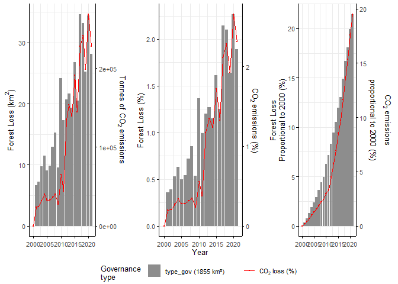

This is the script for the assessment of the impact of different
governance mechanisms on forest loss and its associated carbon emissions
in the Peruvian Amazon from 2000 to 2021 done for the article “Potential
of different governance mechanisms for achieving Global Biodiversity
Framework goals” (Negret et al. 2024). The study evaluates the
effectiveness of protected areas (PAs) and potential OECMs, particularly
Indigenous Lands and Non-Timber Forest Products Concessions, in the
Peruvian Amazon from 2000 to 2021. It uses a robust before-after control
intervention design with statistical matching to account for non-random
deforestation pressures and governance types.

The input of the script is a data table where the rows represent pixels
and the columns represent covariates. You must include a column that
indicates the type of governance or management area, using 1s and 0s.

Link to the article;
<https://www.researchsquare.com/article/rs-4170734/v1>

# Load libraries

    # List necessary packages
    packages_list<-list("magrittr", "dplyr", "plyr", "MatchIt", "RItools", "Hmisc", "this.path", "scales", "ggdendro", "data.table", "openxlsx",
                        "tibble", "leaps", "pbapply", "RColorBrewer", "ggpubr", "ggdist", "ggh4x")

    # Install necessary packages not installed
    packagesPrev<- .packages(all.available = TRUE)
    lapply(packages_list, function(x) {   if ( ! x %in% packagesPrev ) { install.packages(x, force=T)}    })

    # Load libraries
    lapply(packages_list, library, character.only = TRUE)

    packages_list<-list("magrittr", "dplyr", "plyr", "ggplot2")
    lapply(packages_list, library, character.only = TRUE)

# Define workspace

    # Set working directory
    # Uses 'this.path::this.path()' to find the path of the current R script and 'dirname()' to get its directory. This directory is set as the working directory where the current code is stored.
    dir_work<- this.path::this.path() %>% dirname()

    # Set input - output folder
    # Establishes paths for input and output directories relative to 'dir_work'. 'file.path()' constructs the path to the directories ensuring it is OS independent.
    input<- file.path(dirname(dir_work), "input")
    output<- file.path(dirname(dir_work), "output")

# Load data

    # Load data. The data should be a table where rows correspond to spatial units (e.g., pixels) and columns represent variables.
    # Each spatial unit (row) will serve as the input for the matching process, which will be performed based on the similarity between covariables (columns)
    setwd(input)
    data<- readRDS("data.rds")

    names(data)

    ##  [1] "X"            "Y"            "PUID"         "Carbon"       "Department"  
    ##  [6] "Anual_Prec"   "Prec_Seas"    "Dis_Def"      "Dis_Rivers"   "District_R"  
    ## [11] "Departme_R"   "National_R"   "D7Set10"      "D7Set1000"    "D7Set5000"   
    ## [16] "D7Set10000"   "D17Set10"     "D17Set1000"   "D17Set5000"   "D17Set10000" 
    ## [21] "Ecoregions"   "Elevation"    "Pop2000"      "Pop2020"      "Slope"       
    ## [26] "Tra_Time00"   "Tra_Time15"   "Fores_2000"   "Fores_2005"   "Fores_2010"  
    ## [31] "Fores_2021"   "Carbon_pixel" "PA"           "IL"           "CC"          
    ## [36] "LC"           "MC"           "psvalue"

    head(data)

    ##           X       Y   PUID   Carbon Department Anual_Prec Prec_Seas  Dis_Def
    ## 178 1105751 8443292 149038 52.88590          8       2486        53 324.5000
    ## 183 1108463 8441966 149090 23.76750          8       2239        55 182.4830
    ## 193 1107703 8440151 149404 37.75690          8       2388        54  60.0000
    ## 200 1105832 8441130 149801 54.71670          8       2538        52 234.3070
    ## 209 1102617 8433531 150087  5.94987          8       1774        61  84.8528
    ## 215 1107531 8439304 150275 53.05250          8       2284        55 120.0000
    ##     Dis_Rivers District_R Departme_R National_R D7Set10 D7Set1000 D7Set5000
    ## 178    6829.60   12661.70    6430.51   17222.10 10786.7   34787.8    159891
    ## 183    7410.00    9654.59    6896.87   15998.20 11634.8   32044.3    160779
    ## 193    9355.77    9522.48    8846.54   14134.60 12882.7   31405.2    162674
    ## 200    8794.91   11615.30    8415.25   15061.10 10971.5   32715.1    162004
    ## 209   15216.20   14386.60   15230.00    8188.41 11930.5   24552.9    170075
    ## 215   10205.80    9432.84    9694.64   13281.60 12990.1   31011.4    163532
    ##     D7Set10000 D17Set10 D17Set1000 D17Set5000 D17Set10000 Ecoregions Elevation
    ## 178     159891 3738.580    18691.2     146583      159891          8      1469
    ## 183     160779 2588.010    15672.9     149449      160779          8      1977
    ## 193     162674  939.149    15625.0     150193      162674          8      1673
    ## 200     162004 1740.260    17715.9     148183      162004          8      1397
    ## 209     170075 7530.720    19774.6     151555      170075          8      2522
    ## 215     163532  782.304    15523.4     150666      163532          8      1768
    ##       Pop2000   Pop2020    Slope Tra_Time00 Tra_Time15 Fores_2000 Fores_2005
    ## 178 0.0262554 0.0357465  57.7410        770        685          1          1
    ## 183 0.0317090 0.0420932  41.6500        442        451          1          1
    ## 193 0.0351959 0.0333368  31.3803        485        508          1          1
    ## 200 0.0307703 0.0363957  49.6271        639        607          1          1
    ## 209 0.0449926 0.0193342 120.7510        205        707          1          1
    ## 215 0.0378849 0.0231144  37.7905        462        508          1          1
    ##     Fores_2010 Fores_2021 Carbon_pixel PA IL CC LC MC     psvalue
    ## 178          1          1    4.7597309 NA NA NA NA  1 0.004631550
    ## 183          1          1    2.1390750 NA NA NA NA  1 0.008777402
    ## 193          1          1    3.3981211 NA NA NA NA  1 0.008442159
    ## 200          1          1    4.9245031 NA NA NA NA  1 0.005549685
    ## 209          1          1    0.5354883 NA NA NA NA  1 0.009464278
    ## 215          1          1    4.7747252 NA NA NA NA  1 0.008541629

    # Specify the column name in data that defines spatial units in relation to governance type. 
    # This column indicates which spatial units are associated with a type of governance (1) and which are not (0).
    type_gov<- "MC"
    data<- data[!is.na(data[,type_gov]),]
    table(data[,type_gov])

    ## 
    ##      0      1 
    ## 245180    934

# test multicolinearity

    # List preliminary covariates-columns in "data" table to estimate similarity for matching.
    # These are considered preliminary as they will undergo multicollinearity tests and significance checks in relation to governance type.
      covars<-c( "Department", "Anual_Prec", "Prec_Seas",  "Dis_Def",    "Dis_Rivers",
                "District_R", "Departme_R", "National_R", "D7Set10",    "D7Set1000",  "D7Set5000",  "D7Set10000", "D17Set10",   "D17Set1000", "D17Set5000",
                "D17Set10000", "Ecoregions", "Elevation",  "Pop2000",    "Pop2020",    "Slope",      "Tra_Time00", "Tra_Time15")

    # Evaluate multicollinearity
    formula_test_multicor<- as.formula( paste0(type_gov, "~", paste0(covars, collapse = "+")) )
    test_multicor<- glm(formula_test_multicor, data = data, family = binomial()) # sort by variance inflation

    print(formula_test_multicor)

    ## MC ~ Department + Anual_Prec + Prec_Seas + Dis_Def + Dis_Rivers + 
    ##     District_R + Departme_R + National_R + D7Set10 + D7Set1000 + 
    ##     D7Set5000 + D7Set10000 + D17Set10 + D17Set1000 + D17Set5000 + 
    ##     D17Set10000 + Ecoregions + Elevation + Pop2000 + Pop2020 + 
    ##     Slope + Tra_Time00 + Tra_Time15

    test_multicor

    ## 
    ## Call:  glm(formula = formula_test_multicor, family = binomial(), data = data)
    ## 
    ## Coefficients:
    ## (Intercept)   Department   Anual_Prec    Prec_Seas      Dis_Def   Dis_Rivers  
    ##  -6.929e+00    6.682e-02    1.741e-04    4.758e-02   -5.745e-04   -3.001e-05  
    ##  District_R   Departme_R   National_R      D7Set10    D7Set1000    D7Set5000  
    ##  -5.490e-05    3.424e-05   -3.051e-05   -5.634e-05   -2.857e-05   -1.357e-05  
    ##  D7Set10000     D17Set10   D17Set1000   D17Set5000  D17Set10000   Ecoregions  
    ##  -1.283e-04   -5.541e-06    5.539e-05   -2.307e-05    1.621e-04   -2.827e-03  
    ##   Elevation      Pop2000      Pop2020        Slope   Tra_Time00   Tra_Time15  
    ##   2.292e-04    5.773e-02    6.310e-04   -6.679e-03   -2.982e-04   -1.017e-05  
    ## 
    ## Degrees of Freedom: 246113 Total (i.e. Null);  246090 Residual
    ## Null Deviance:       12280 
    ## Residual Deviance: 8159  AIC: 8207

    # The results of this  model are organized as a correlation matrix, which displays multicollinearity among covariates with respect to the response variable typegov.
    cordataR<- summary(test_multicor, correlation=T)[["correlation"]] %>% as.data.frame.matrix()
    cordataR[,"(Intercept)"]<- NULL; cordataR<- cordataR[2:nrow(cordataR), ]# ELIMINATE INTERCEPT CORRELATION MATRIX

    NACol<- names(which(rowSums(is.na(cordataR)) > (ncol(cordataR)/2) ))
    cordata<- cordataR %>% {.[!names(.) %in% NACol,]} %>% {.[,!colnames(.) %in% NACol]}; cordata[is.na(cordata)]<-0

    str(cordata)

    ## 'data.frame':    23 obs. of  23 variables:
    ##  $ Department : num  1 0.03251 0.16061 -0.00873 -0.07882 ...
    ##  $ Anual_Prec : num  0.03251 1 0.05158 -0.09212 -0.00162 ...
    ##  $ Prec_Seas  : num  0.16061 0.05158 1 0.00399 0.11367 ...
    ##  $ Dis_Def    : num  -0.00873 -0.09212 0.00399 1 -0.06524 ...
    ##  $ Dis_Rivers : num  -0.07882 -0.00162 0.11367 -0.06524 1 ...
    ##  $ District_R : num  -0.0418 -0.0958 0.1711 -0.0451 0.0432 ...
    ##  $ Departme_R : num  0.2955 -0.0331 0.0932 -0.0655 0.0164 ...
    ##  $ National_R : num  0.00751 0.0522 -0.05401 0.00563 0.01502 ...
    ##  $ D7Set10    : num  -0.09174 0.02181 -0.11619 -0.00856 -0.10002 ...
    ##  $ D7Set1000  : num  0.01 0.1813 -0.0592 0.0066 0.0523 ...
    ##  $ D7Set5000  : num  -0.0343 -0.2995 -0.3185 0.0181 -0.0757 ...
    ##  $ D7Set10000 : num  0.04494 0.09653 0.00911 0.01956 0.02772 ...
    ##  $ D17Set10   : num  -0.0516 -0.0447 -0.0273 -0.0855 -0.0549 ...
    ##  $ D17Set1000 : num  -0.0807 -0.0777 -0.0369 -0.0617 -0.0181 ...
    ##  $ D17Set5000 : num  -0.10226 0.5568 -0.0894 0.0101 -0.00855 ...
    ##  $ D17Set10000: num  -0.02179 -0.09182 0.04348 -0.02474 -0.00846 ...
    ##  $ Ecoregions : num  0.0896 0.0403 0.1631 0.021 -0.0374 ...
    ##  $ Elevation  : num  0.2237 0.3978 -0.41 0.0183 -0.1049 ...
    ##  $ Pop2000    : num  0.0506 0.0611 0.0637 0.0331 0.0263 ...
    ##  $ Pop2020    : num  -0.002285 -0.001836 -0.000998 0.000707 -0.003885 ...
    ##  $ Slope      : num  0.0852 -0.0395 -0.0197 0.0401 0.0436 ...
    ##  $ Tra_Time00 : num  0.0247 0.1118 0.0342 0.0104 -0.0973 ...
    ##  $ Tra_Time15 : num  -0.01843 0.05634 0.09136 -0.04218 -0.00846 ...

    head(cordata)

    ##             Department   Anual_Prec   Prec_Seas      Dis_Def   Dis_Rivers
    ## Department  1.00000000  0.032505326 0.160609805 -0.008725980 -0.078823328
    ## Anual_Prec  0.03250533  1.000000000 0.051581571 -0.092119965 -0.001618779
    ## Prec_Seas   0.16060980  0.051581571 1.000000000  0.003985557  0.113671007
    ## Dis_Def    -0.00872598 -0.092119965 0.003985557  1.000000000 -0.065241011
    ## Dis_Rivers -0.07882333 -0.001618779 0.113671007 -0.065241011  1.000000000
    ## District_R -0.04178543 -0.095832427 0.171078442 -0.045051635  0.043185133
    ##             District_R  Departme_R   National_R     D7Set10   D7Set1000
    ## Department -0.04178543  0.29552639  0.007505277 -0.09174172  0.01004060
    ## Anual_Prec -0.09583243 -0.03305699  0.052197735  0.02181235  0.18126409
    ## Prec_Seas   0.17107844  0.09321904 -0.054005574 -0.11619138 -0.05915869
    ## Dis_Def    -0.04505164 -0.06551750  0.005625617 -0.00856436  0.00660381
    ## Dis_Rivers  0.04318513  0.01638816  0.015021251 -0.10002336  0.05232755
    ## District_R  1.00000000 -0.09475910 -0.015679282 -0.04379188 -0.08406537
    ##              D7Set5000  D7Set10000    D17Set10  D17Set1000   D17Set5000
    ## Department -0.03430716 0.044942221 -0.05162315 -0.08074973 -0.102257217
    ## Anual_Prec -0.29948553 0.096534300 -0.04474397 -0.07771157  0.556799495
    ## Prec_Seas  -0.31851473 0.009110956 -0.02726464 -0.03689956 -0.089404325
    ## Dis_Def     0.01807623 0.019561263 -0.08551638 -0.06166245  0.010101990
    ## Dis_Rivers -0.07565404 0.027716651 -0.05494112 -0.01812928 -0.008553665
    ## District_R  0.14074799 0.046213909 -0.10357965 -0.19311632 -0.011802726
    ##             D17Set10000  Ecoregions   Elevation     Pop2000       Pop2020
    ## Department -0.021790893  0.08961566  0.22369355  0.05063298 -0.0022854692
    ## Anual_Prec -0.091821064  0.04025275  0.39776589  0.06105794 -0.0018360471
    ## Prec_Seas   0.043477335  0.16307552 -0.41001914  0.06366587 -0.0009979708
    ## Dis_Def    -0.024744125  0.02104548  0.01827189  0.03307967  0.0007072675
    ## Dis_Rivers -0.008457375 -0.03743994 -0.10488495  0.02627021 -0.0038845953
    ## District_R -0.073240915  0.02042709 -0.05908218 -0.02618374  0.0007210510
    ##                  Slope  Tra_Time00   Tra_Time15
    ## Department  0.08520488  0.02470843 -0.018431359
    ## Anual_Prec -0.03952660  0.11176616  0.056341197
    ## Prec_Seas  -0.01969954  0.03416434  0.091357560
    ## Dis_Def     0.04012618  0.01043568 -0.042178365
    ## Dis_Rivers  0.04361611 -0.09726303 -0.008464001
    ## District_R -0.03003442  0.07727625 -0.321160504

    # From the correlation matrix, we must decide which variables to remove to reduce multicollinearity. To achieve this, we generate groups of correlated variables using a correlation threshold.
    cor_threshold<- 0.65 # define correlation threshold

    # Covariate clustering
    corhclust <- hclust(as.dist(1-abs(cordata))) 
    cordend<-as.dendrogram(corhclust)
    cordend_data <- dendro_data(cordend)

    # Plot dendrogram of correlated variables. The dendrogram visualizes the correlation among variables, highlighting groups of correlated covariables based on the defined correlation threshold (cor_threshold) marked by a red line.
    var_table <- with(cordend_data$labels, data.frame(y_center = x, y_min= x-0.5, y_max=x+0.5, Variable = as.character(label), height = 1))
    col1<- "#EBEBEB"; col2<- "white"; is.even<- function(x){ x %% 2 == 0 }
    var_table$col<- rep_len(c(col1, col2), length.out=length(var_table$Variable)) %>% {if(is.even(length(.))) {rev(.)} else {.}}
    segment_data <- with(segment(cordend_data), data.frame(x = y, y = x, xend = yend, yend = xend, cor= 1-yend))

    ggdendroPlot <-   ggplot()+
      annotate("rect", xmin = -0.05, xmax = 1.04, fill = var_table$col,ymin = var_table$y_min , ymax = var_table$y_max, alpha = 0.75 )+
      geom_segment(data= segment_data, aes(x = 1-x, y = y, xend = 1-xend, yend = yend, label= cor), size= 0.3)+
      scale_y_continuous(breaks = cordend_data$labels$x,  labels = cordend_data$labels$label )+
      coord_cartesian(expand = F)+
      labs(x= "Correlation", y= "Variables") +
      geom_vline(xintercept = cor_threshold, linetype = "dashed", col= "red") +
      theme(legend.position =  "bottom", legend.key.width = unit(50, 'pt'),
            plot.margin = margin(t = 0, r = 0,  b = 0,l = 0),
            panel.grid.major = element_line(color = "gray"),
            axis.ticks.length   = unit(0.3, "mm"),
            text = element_text(size = 10))

    print(ggdendroPlot)

      # Remove high-correlated variables. Following exploration, we select one variable per group to reduce multicollinearity, choosing the variable with the lowest VIF in each group. 
    vif_data<- car::vif(test_multicor) %>% as.data.frame() %>% {data.frame(Var= rownames(.), VIF= .[,1])} %>% arrange(VIF)
    vif_values <-  vif_data %>% 
        dplyr::mutate(Variable1= Var, VIF_var1= VIF, Variable2= Var, VIF_var2= VIF) %>%  dplyr::arrange("VIF")
    rank_covars<- cutree(corhclust, h = 1-cor_threshold) %>% as.data.frame %>% rownames_to_column("Var") %>% setnames(".", "group") %>%
          dplyr::filter(!Var %in% "(Intercept)") %>% list(vif_data) %>% join_all() %>% arrange(group, VIF)
        
    covars_no_multicol<- dplyr::filter(rank_covars, !duplicated(group))$Var

    print(rank_covars)

    ##            Var group         VIF
    ## 1   Department     1    1.686904
    ## 2   Anual_Prec     2    5.044480
    ## 3    Prec_Seas     3    2.576239
    ## 4      Dis_Def     4    1.187174
    ## 5   Dis_Rivers     5    1.174632
    ## 6   District_R     6    2.221542
    ## 7   Departme_R     7    1.459723
    ## 8   National_R     8    2.609948
    ## 9      D7Set10     9    2.735404
    ## 10   D7Set1000    10    3.106596
    ## 11  D17Set1000    10    3.245172
    ## 12   D7Set5000    11   33.898956
    ## 13  D7Set10000    12 1059.526642
    ## 14 D17Set10000    12 1076.676371
    ## 15    D17Set10    13    2.622886
    ## 16  D17Set5000    14    2.271917
    ## 17  Ecoregions    15    2.053750
    ## 18   Elevation    16    4.997142
    ## 19     Pop2000    17    1.126313
    ## 20     Pop2020    18    1.019657
    ## 21       Slope    19    1.890821
    ## 22  Tra_Time00    20    1.756650
    ## 23  Tra_Time15    21    3.058327

    print(covars_no_multicol)

    ##  [1] "Department" "Anual_Prec" "Prec_Seas"  "Dis_Def"    "Dis_Rivers"
    ##  [6] "District_R" "Departme_R" "National_R" "D7Set10"    "D7Set1000" 
    ## [11] "D7Set5000"  "D7Set10000" "D17Set10"   "D17Set5000" "Ecoregions"
    ## [16] "Elevation"  "Pop2000"    "Pop2020"    "Slope"      "Tra_Time00"
    ## [21] "Tra_Time15"

    # Optimization and adjustment for selecting the best model ####
    pre_formula_glm<- as.formula( paste0(type_gov, "~", paste0(covars_no_multicol, collapse = "+")) ) # new formula with variables that do not exhibit multicollinearity

    print(pre_formula_glm)

    ## MC ~ Department + Anual_Prec + Prec_Seas + Dis_Def + Dis_Rivers + 
    ##     District_R + Departme_R + National_R + D7Set10 + D7Set1000 + 
    ##     D7Set5000 + D7Set10000 + D17Set10 + D17Set5000 + Ecoregions + 
    ##     Elevation + Pop2000 + Pop2020 + Slope + Tra_Time00 + Tra_Time15

      # Estimate forward and backward models. adds and removes variables through multiple iterations to find the optimal model that balances complexity with predictive power. We use AIC to select the best model.
    model  <- regsubsets(pre_formula_glm, data = data, nvmax = length(covars), method = "seqrep")
    summ_model<-summary(model)[c("rsq", "rss", "adjr2", "cp", "bic" )] %>% as.data.frame() %>% dplyr::mutate(model= seq(nrow(.)))
    list_models<- seq(nrow(summ_model))
    AIC_models<- pblapply(list_models, function(x){
        coefs<- coef(model, id = x) # get coefficients
        vars<- names(coefs)[-1] # get vars
        form_test<- as.formula( paste0(type_gov, "~", paste0(vars, collapse = "+")) ) # organize form
        glm_test<- glm(form_test, data = data, family = binomial()) # run glm
        data_AIC<- data.frame(model= x, AIC= extractAIC(glm_test)[2]) # get AIC
        data_vars <- data.frame(model= x, vars= vars) # get data vars
        data_form<- data.frame(model= x, formula = paste0(type_gov, "~", paste0(vars, collapse = "+")) ) # get data forms
        list(data_AIC=data_AIC, data_vars=data_vars, data_form= data_form )   })
      
    # Ranking models
    # Compiles the formulas of models evaluated by AIC into a single dataframe for easy comparison.
    forms_models<- rbind.fill(purrr::map(AIC_models, "data_form"))

    print(forms_models)

    ##    model
    ## 1      1
    ## 2      2
    ## 3      3
    ## 4      4
    ## 5      5
    ## 6      6
    ## 7      7
    ## 8      8
    ## 9      9
    ## 10    10
    ## 11    11
    ## 12    12
    ## 13    13
    ## 14    14
    ## 15    15
    ## 16    16
    ## 17    17
    ## 18    18
    ## 19    19
    ## 20    20
    ## 21    21
    ##                                                                                                                                                                                                               formula
    ## 1                                                                                                                                                                                                       MC~Tra_Time15
    ## 2                                                                                                                                                                                             MC~Anual_Prec+Prec_Seas
    ## 3                                                                                                                                                                                  MC~Anual_Prec+Prec_Seas+Tra_Time15
    ## 4                                                                                                                                                                        MC~Anual_Prec+Prec_Seas+District_R+Elevation
    ## 5                                                                                                                                                               MC~Anual_Prec+Prec_Seas+District_R+D17Set10+Elevation
    ## 6                                                                                                                                                     MC~Anual_Prec+Prec_Seas+D7Set5000+D17Set10+D17Set5000+Elevation
    ## 7                                                                                                                                             MC~Anual_Prec+Prec_Seas+D7Set10+D7Set5000+D17Set10+D17Set5000+Elevation
    ## 8                                                                                                                                     MC~Anual_Prec+Prec_Seas+D7Set10+D7Set5000+D17Set10+D17Set5000+Elevation+Pop2000
    ## 9                                                                                                                               MC~Anual_Prec+Prec_Seas+D7Set10+D7Set5000+D17Set10+D17Set5000+Elevation+Pop2000+Slope
    ## 10                                                                                                              MC~Anual_Prec+Prec_Seas+District_R+Departme_R+D7Set10+D7Set5000+D17Set10+D17Set5000+Elevation+Pop2000
    ## 11                                                                                                        MC~Anual_Prec+Prec_Seas+District_R+Departme_R+D7Set10+D7Set5000+D17Set10+D17Set5000+Elevation+Pop2000+Slope
    ## 12                                                                                      MC~Department+Anual_Prec+Prec_Seas+Dis_Def+Dis_Rivers+District_R+Departme_R+National_R+D7Set10+D7Set1000+D7Set5000+D7Set10000
    ## 13                                                                                  MC~Anual_Prec+Prec_Seas+Dis_Rivers+District_R+Departme_R+D7Set10+D7Set5000+D17Set10+D17Set5000+Elevation+Pop2000+Slope+Tra_Time00
    ## 14                                                                  MC~Department+Anual_Prec+Prec_Seas+Dis_Def+Dis_Rivers+District_R+Departme_R+National_R+D7Set10+D7Set1000+D7Set5000+D7Set10000+D17Set10+D17Set5000
    ## 15                                                             MC~Department+Anual_Prec+Prec_Seas+Dis_Rivers+District_R+Departme_R+D7Set10+D7Set1000+D7Set5000+D17Set10+D17Set5000+Elevation+Pop2000+Slope+Tra_Time00
    ## 16                                             MC~Department+Anual_Prec+Prec_Seas+Dis_Def+Dis_Rivers+District_R+Departme_R+National_R+D7Set10+D7Set1000+D7Set5000+D7Set10000+D17Set10+D17Set5000+Ecoregions+Elevation
    ## 17                                          MC~Department+Anual_Prec+Prec_Seas+Dis_Def+Dis_Rivers+District_R+Departme_R+D7Set10+D7Set1000+D7Set5000+D7Set10000+D17Set10+D17Set5000+Elevation+Pop2000+Slope+Tra_Time00
    ## 18                               MC~Department+Anual_Prec+Prec_Seas+Dis_Def+Dis_Rivers+District_R+Departme_R+D7Set10+D7Set1000+D7Set5000+D7Set10000+D17Set10+D17Set5000+Ecoregions+Elevation+Pop2000+Slope+Tra_Time00
    ## 19                    MC~Department+Anual_Prec+Prec_Seas+Dis_Def+Dis_Rivers+District_R+Departme_R+National_R+D7Set10+D7Set1000+D7Set5000+D7Set10000+D17Set10+D17Set5000+Ecoregions+Elevation+Pop2000+Slope+Tra_Time00
    ## 20            MC~Department+Anual_Prec+Prec_Seas+Dis_Def+Dis_Rivers+District_R+Departme_R+National_R+D7Set10+D7Set1000+D7Set5000+D7Set10000+D17Set10+D17Set5000+Ecoregions+Elevation+Pop2000+Pop2020+Slope+Tra_Time00
    ## 21 MC~Department+Anual_Prec+Prec_Seas+Dis_Def+Dis_Rivers+District_R+Departme_R+National_R+D7Set10+D7Set1000+D7Set5000+D7Set10000+D17Set10+D17Set5000+Ecoregions+Elevation+Pop2000+Pop2020+Slope+Tra_Time00+Tra_Time15

      # Aggregates AIC information, merges it with summary model data, and ranks models based on BIC and AIC values to identify the best performers.
    better_models<- rbind.fill(purrr::map(AIC_models, "data_AIC")) %>% list(summ_model) %>% join_all() %>% 
        dplyr::arrange( bic) %>% dplyr::mutate(rank_BIC= seq(nrow(.))) %>% 
        dplyr::arrange(AIC) %>% dplyr::mutate(rank_AIC= seq(nrow(.)))

    print(better_models)

    ##    model       AIC         rsq      rss       adjr2         cp       bic
    ## 1     19  8558.893 0.023772632 908.3361 0.023697261   18.08911 -5673.173
    ## 2     20  8560.805 0.023772918 908.3358 0.023693580   20.01681 -5660.832
    ## 3     21  8562.537 0.023772985 908.3358 0.023689680   22.00000 -5648.435
    ## 4     18  8585.160 0.023771519 908.3371 0.023700116   16.36953 -5685.306
    ## 5     17  8588.001 0.023765157 908.3431 0.023697720   15.97347 -5696.115
    ## 6     16  8592.222 0.023481595 908.6069 0.023418106   85.45513 -5637.052
    ## 7     14  8623.559 0.022279442 909.7255 0.022223822  384.49942 -5359.084
    ## 8     15  8665.919 0.023714604 908.3901 0.023655098   24.71696 -5708.198
    ## 9     13  8766.380 0.023611744 908.4858 0.023560167   46.64644 -5707.097
    ## 10    12  8785.059 0.018706667 913.0498 0.018658819 1281.14188 -4486.204
    ## 11    11  8828.707 0.023454286 908.6323 0.023410638   82.33909 -5692.237
    ## 12    10  8851.177 0.023347485 908.7317 0.023307801  107.26204 -5677.736
    ## 13     5  9124.066 0.019660996 912.1618 0.019641079 1026.57003 -4812.566
    ## 14     9  9130.066 0.023232825 908.8384 0.023197104  134.16627 -5661.257
    ## 15     7  9152.121 0.023019360 909.0370 0.022991572  183.97748 -5632.303
    ## 16     8  9153.684 0.023141077 908.9237 0.023109323  155.29434 -5650.554
    ## 17     4  9169.441 0.018199195 913.5219 0.018183238 1393.06774 -4458.268
    ## 18     6  9246.963 0.022740865 909.2961 0.022717040  252.18171 -5574.571
    ## 19     3  9283.472 0.015633074 915.9096 0.015621075 2037.94801 -3828.256
    ## 20     1  9944.711 0.005783194 925.0745 0.005779154 4516.95313 -1402.629
    ## 21     2 10439.284 0.011246737 919.9909 0.011238702 3141.67685 -2746.422
    ##    rank_BIC rank_AIC
    ## 1         7        1
    ## 2         9        2
    ## 3        11        3
    ## 4         5        4
    ## 5         3        5
    ## 6        12        6
    ## 7        15        7
    ## 8         1        8
    ## 9         2        9
    ## 10       17       10
    ## 11        4       11
    ## 12        6       12
    ## 13       16       13
    ## 14        8       14
    ## 15       13       15
    ## 16       10       16
    ## 17       18       17
    ## 18       14       18
    ## 19       19       19
    ## 20       21       20
    ## 21       20       21

    # Selection of the best model
    # Allows the researcher to review the ranked models based on selected criteria (default: AIC)
    critera<- "AIC" # DEFAULT

    # Collates variables from the best AIC models, ranks them by frequency of appearance, and prepares them for visualization analysis.
    data_vars<-  rbind.fill(purrr::map(AIC_models, "data_vars")) %>% list(better_models) %>% 
        join_all() %>%  dplyr::group_by(vars) %>% dplyr::mutate(freq_var= n()) %>% 
        dplyr::arrange(freq_var) %>% dplyr::mutate(vars= factor(vars, levels = unique(.$vars)) ) 
      
    # Organizes and ranks models based on the selected criterion preparing for the selection of the best model.
    vars_models<- data_vars %>% dplyr::arrange(eval(sym(critera))) %>% 
        dplyr::mutate(model= factor(model, levels = unique(.$model)) ) %>% as.data.frame()
      

    # Identifies the best model based on the ranking, setting it aside for in-depth analysis and use in matching.
    better_model<- unique(vars_models[1,1])

    print(better_model)

    ## [1] 19
    ## Levels: 19 20 21 18 17 16 14 15 13 12 11 10 5 9 7 8 4 6 3 1 2

    # Selected variables for the best model
    selected_variables<- data_vars %>% dplyr::arrange(eval(sym(critera))) %>% 
      dplyr::filter(model %in% better_model) %>% {as.character(.$vars)}

    print(selected_variables)

      # Plot best models' AIC by variable. The heatmap displays the top-performing models horizontally and the most impactful variables vertically. Warmer hues indicate superior AIC values, illustrating the effectiveness of each variable within the highest-ranked models as per the chosen metric (AIC). 
    plot_better_model<-  ggplot()+
        geom_tile(data= vars_models, aes(x= model , y= vars, fill = eval(sym(critera)) ), color="black", alpha= 0.5, size=0.2)+
        scale_fill_gradientn(critera, colors = brewer.pal(11, "Spectral"))  

    print(plot_better_model)

# Pre-matching exploratory analysis

This phase involves analyzing distributions and assessing the balance of
variables across the type of governance groups. It provides an initial
diagnostic of the data, setting the stage for understanding the impact
of the matching process.

      # Propensity scores calculation.
      # Identifies the 'treated' group based on type of governance, then calculates the standardized differences for selected variables before matching.
    treated <-(data[,type_gov] ==1) 
    cov <-data[,selected_variables]
    std.diff <-apply(cov,2,function(x) 100*(mean(x[treated])- mean(x[!treated]))/(sqrt(0.5*(var(x[treated]) + var(x[!treated]))))) %>% abs()
      
    # Generate a propensity score model
    formula_glm<- as.formula( paste0(type_gov, "~", paste0(selected_variables, collapse = "+")) )

    print(formula_glm)

    ## MC ~ Ecoregions + National_R + Tra_Time00 + Dis_Def + D7Set10000 + 
    ##     Department + D7Set1000 + Slope + Dis_Rivers + Pop2000 + Departme_R + 
    ##     District_R + D7Set10 + D17Set5000 + D7Set5000 + D17Set10 + 
    ##     Elevation + Anual_Prec + Prec_Seas

    ps <- glm(formula_glm, data = data, family = binomial())

    # Estimate propensity scores predicted by the logistic model.
    data$psvalue <- predict(ps, type = "response")

    # Organizes standardized differences for easy analysis and visualization, highlighting variables with the most imbalance.
    PreMatchingIndexData<- data.frame(abs(std.diff)) %>% set_names("imbalance") %>% tibble::rownames_to_column(var="Variable") %>%  arrange(imbalance)

      # A good balance is considered to be less than 25%. For visualization purposes, imbalances greater than 100% are capped at 100%. # An imbalance over 25% indicates significant differences in group characteristics.

    PreMatchingIndexDataV2<- PreMatchingIndexData  %>%  arrange(desc(imbalance)) %>%
        mutate(imbalance= ifelse(imbalance>=100,100,imbalance)) %>% 
        mutate(Variable= factor(Variable, levels = unique(.$Variable)), label= paste0(paste(paste(rep("   ",3), collapse = ""), collapse = ""), Variable, sep=""))

    print(PreMatchingIndexDataV2)

    ##      Variable imbalance               label
    ## 1  National_R 100.00000          National_R
    ## 2  Tra_Time00 100.00000          Tra_Time00
    ## 3  District_R 100.00000          District_R
    ## 4   Prec_Seas 100.00000           Prec_Seas
    ## 5    D17Set10 100.00000            D17Set10
    ## 6     D7Set10 100.00000             D7Set10
    ## 7     Dis_Def 100.00000             Dis_Def
    ## 8  D17Set5000 100.00000          D17Set5000
    ## 9   D7Set1000 100.00000           D7Set1000
    ## 10 Departme_R  87.26923          Departme_R
    ## 11 D7Set10000  77.11723          D7Set10000
    ## 12  Elevation  72.17227           Elevation
    ## 13 Dis_Rivers  68.86277          Dis_Rivers
    ## 14 Ecoregions  63.22910          Ecoregions
    ## 15      Slope  54.36166               Slope
    ## 16 Department  51.04086          Department
    ## 17  D7Set5000  47.47929           D7Set5000
    ## 18    Pop2000  29.05575             Pop2000
    ## 19 Anual_Prec  27.15450          Anual_Prec

# Execute matching analysis

     # Performs matching based on the specified criteria
      # The 'formula_glm' defines the treatment indicator and covariates for matching, 'method = "nearest"'.
    m.nn <- matchit(formula_glm, data =data, method= "nearest", ratio = 1)

    # Extracts the matched dataset and calculates the deforestation indicator. 'deforest' is defined as 1 if the forest status changed from present ('Fores_2000' == 1) to absent ('Fores_2021' == 0) over the study period, and 0 otherwise.
      y=match.data(m.nn, group="all")

    # Propensity scores calculation. 
    treated1 <-(y[, type_gov]==1)

    cov1 <-y[, selected_variables]
    std.diff1 <-apply(cov1,2,function(x) 100*(mean(x[treated1])- mean(x[!treated1]))/(sqrt(0.5*(var(x[treated1]) + var(x[!treated1]))))) 
      
    # Organizes standardized differences for easy analysis and visualization
    posmatchingIndexData<- data.frame(abs(std.diff1)) %>% set_names("imbalance") %>% tibble::rownames_to_column(var="Variable") %>%  arrange(imbalance)
    posmatchingIndexDataV2<- posmatchingIndexData  %>%  arrange(desc(imbalance)) %>%
      mutate(imbalance= ifelse(imbalance>=100,100,imbalance)) %>% 
      mutate(Variable= factor(Variable, levels = unique(.$Variable)), label= paste0(paste(paste(rep("   ",3), collapse = ""), collapse = ""), Variable, sep=""))

    # Estimate percent balance improvement. Organize the standardized differences before and after matching data.
    summ_Imbalancedata<- plyr::rbind.fill(list( dplyr::mutate(PreMatchingIndexDataV2, Match= "Unmatched"),  dplyr::mutate(posmatchingIndexDataV2, Match= "Matched")))

      
    # Plotting imbalance data. The plot demonstrates the improvements in variable imbalance before and after matching.

    y_axis_title_unbalanced_vars_posmatch<- "Index of covariate imbalance"
    x_axis_title_unbalanced_vars_posmatch<- "Variables"
    legend_title_unbalanced_vars_posmatch<- "Pixeles de la ventana"
    plot_title_unbalanced_vars_posmatch<- "Pos Matching"
    color_vline_unbalanced_vars_posmatch<- "red"
    pos_vline_unbalanced_vars_posmatch<- 25

    gg_summ_Imbalancedata<- ggplot(data= summ_Imbalancedata)+  
      geom_point(aes(x=imbalance, y= Variable, color= Match), size= 1) +
      labs(x= y_axis_title_unbalanced_vars_posmatch, y= x_axis_title_unbalanced_vars_posmatch)+
      geom_vline(aes(xintercept= pos_vline_unbalanced_vars_posmatch),  size= 0.5, linetype="dashed", color = color_vline_unbalanced_vars_posmatch)+
      theme(
        plot.margin = margin(t = 0, r = 0,  b = 0,l = 0),
        axis.ticks.length   = unit(0.3, "mm"),
        text = element_text(size = 10),
        panel.background = element_rect(fill = NA), panel.grid.major = element_line(color = "gray"),
        axis.line = element_line(size = 0.5, colour = "black") )+
      scale_x_continuous(expand = c(0,0), limits = c(0,110))+
      ggtitle(type_gov)

    print(gg_summ_Imbalancedata)

# Plotting Imbalance Figure.

This plot visualizes the distribution of propensity scores before and
after matching through histograms.

      # Splitting the pre-matching data based on the 'type_gov' variable to compare groups inside and outside the treatment condition.
    includedListPreMatching <- split(data, data[, type_gov])

    # Set graphic parameters for pre-matching histograms.
    in_area_prematch <- list(title= paste0("In ", type_gov), color= "goldenrod")
    out_area_prematch <- list(title= paste0("Out ", type_gov), color= "olivedrab")
    y_axis_title_prematch <- "Number of Units"
    x_axis_title_prematch <- "Propensity Score"
    legend_title_prematch <- "Window Pixels"
    plot_title_prematch <- "Pre Matching"

    # Create pre-matching plot.
    PreMatchversusplot <- ggplot(data = includedListPreMatching[["0"]]) +
      geom_histogram(data = includedListPreMatching[["1"]], aes(x = psvalue, y = ..count.., 
                                                                fill = in_area_prematch$title, color = in_area_prematch$title)) +
      geom_histogram(aes(x = psvalue, y = -..count.., fill = out_area_prematch$title, color = out_area_prematch$title)) +
      scale_y_continuous(labels = abs) +
      scale_fill_manual(values = alpha(c(out_area_prematch$color, in_area_prematch$color), 0.5), name = legend_title_prematch) +
      scale_color_manual(values = alpha(c(out_area_prematch$color, in_area_prematch$color), 1), name = legend_title_prematch) +
      labs(x = x_axis_title_prematch, y = y_axis_title_prematch, title = plot_title_prematch) +
      guides(size = "none", fill = guide_legend(title.position="top", title.hjust = 0.5)) +
      theme_minimal() + theme(legend.position = "bottom", text = element_text(size = 10))

    # Splitting the post-matching data.
    includedListposmatching <- split(y, y[, type_gov])

    # Set graphic parameters for post-matching histograms.
    in_area_posmatch <- list(title= paste0("In ", type_gov), color= "goldenrod")
    out_area_posmatch <- list(title= paste0("Out ", type_gov), color= "olivedrab")
    y_axis_title_posmatch <- "Number of Units"
    x_axis_title_posmatch <- "Propensity Score"
    legend_title_posmatch <- "Window Pixels"
    plot_title_posmatch <- "Post Matching"

    # Create post-matching plot.
    posmatchversusplot <- ggplot(data = includedListposmatching[["0"]]) +
      geom_histogram(data = includedListposmatching[["1"]], aes(x = psvalue, y = ..count.., 
                                                                fill = in_area_posmatch$title, color = in_area_posmatch$title)) +
      geom_histogram(aes(x = psvalue, y = -..count.., fill = out_area_posmatch$title, color = out_area_posmatch$title)) +
      scale_y_continuous(labels = abs) +
      scale_fill_manual(values = alpha(c(out_area_posmatch$color, in_area_posmatch$color), 0.5), name = legend_title_posmatch) +
      scale_color_manual(values = alpha(c(out_area_posmatch$color, in_area_posmatch$color), 1), name = legend_title_posmatch) +
      labs(x = x_axis_title_posmatch, y = y_axis_title_posmatch, title = plot_title_posmatch) +
      scale_x_continuous(limits = c(0, 1)) +
      guides(size = "none", fill = guide_legend(title.position="top", title.hjust = 0.5)) +
      theme_minimal() + theme(legend.position = "bottom", text = element_text(size = 10))

    # Arrange pre and post matching plots together for comparison.
    summ_matching_propension_plot <- ggpubr::ggarrange(plotlist = list(PreMatchversusplot, posmatchversusplot), common.legend = T, legend = "bottom")

    print(summ_matching_propension_plot)

# Analysis post-matching

Outputs from the matched groups are evaluated. We assessed changes per
pixel in relation to forests and carbon in 2000 and 2021

    # Map the matched groups
    # Retrieve matching pairs from the 'matchit' result to align the treatment (T) and control (C) groups for further analysis.
    matches <- data.frame(m.nn$match.matrix)
    group1 <- match(row.names(matches), row.names(y))
    group2 <- match(matches[, 1], row.names(y))

    # Estimate forest and carbon trends ####

    ########### Forests effect
    # Extract forest status data for the treated T group at different time points.
    forest_yT2000 <- y$Fores_2000[group1]
    forest_yT2021 <- y$Fores_2021[group1]

    # Extract forest status data for the control C group at different time points.
    forest_yC2000 <- y$Fores_2000[group2]
    forest_yC2021 <- y$Fores_2021[group2]

    ########### Carbon effect
    carbon_yt<- y$Carbon_pixel[group1]
    carbon_yC<- y$Carbon_pixel[group2] 

    ## summ match  
    matched.cases_forest <- cbind(matches, forest_yT2000, forest_yT2021, forest_yC2000, forest_yC2021, carbon_yt, carbon_yC)

# Organize control data

    # control_pre matching. Use the entire dataset to define the control group before matching to understand baseline conditions.
    Control <- data[data[,type_gov] %in% 0, ]
    control_pre_forest_2020 =sum(Control$Fores_2000)
    control_pre_forest_2021 =sum(Control$Fores_2021)

    # Calculate the proportion of forest pixels that remained unchanged in the control group pre-matching.
    Prop_noloss_forest_control_pre= (control_pre_forest_2021/control_pre_forest_2020)*100
    # Calculate the proportion of forest loss in the control group pre-matching.
    Prop_forest_control_pre= 100-Prop_noloss_forest_control_pre

    # Estimate confidence intervals for forest loss proportion in the control group pre-matching.
    # The DescTools::BinomCI function computes confidence intervals for binomial proportions, providing a range of values within which the true proportion is likely to lie.https://rdrr.io/cran/DescTools/man/BinomCI.html
    binomial_test_control_pre<- 100* (1 - DescTools::BinomCI(x= control_pre_forest_2021, n= length(Control$Fores_2000), 
                                                               conf.level = 0.95, method = "wilson" )) %>% as.data.frame()
    lower_def_control_pre<- min(binomial_test_control_pre[c("lwr.ci", "upr.ci")])
    upper_def_control_pre<- max(binomial_test_control_pre[c("lwr.ci", "upr.ci")])
        
    # control_pos matching. Define the control group from the data after matching analysis.
    control_pos_forest_2020 = sum(matched.cases_forest$forest_yC2000)
    control_pos_forest_2021 = sum(matched.cases_forest$forest_yC2021)

    # Calculate the proportion of forest pixels that remained unchanged in the control group pos-matching.
    Prop_noloss_forest_control_pos= (control_pos_forest_2021/control_pos_forest_2020)*100

    # Calculate the proportion of forest loss in the control group pos-matching.
    Prop_forest_control_pos= 100-Prop_noloss_forest_control_pos
      

    # Estimate confidence intervals for forest loss proportion in the control group pos-matching. 
    binomial_test_control_pos<- 100* (1 - DescTools::BinomCI(x= control_pos_forest_2021, n= length(matched.cases_forest$forest_yT2000), 
                                                             conf.level = 0.95, method = "wilson" )) %>% as.data.frame()
    lower_def_control_pos<- min(binomial_test_control_pos[c("lwr.ci", "upr.ci")])
    upper_def_control_pos<- max(binomial_test_control_pos[c("lwr.ci", "upr.ci")])

# Organize treatment data

    # Define the treatment group from the data after matching analysis.
    treatment_forest_2020 = sum(matched.cases_forest$forest_yT2000)
    treatment_forest_2021 = sum(matched.cases_forest$forest_yT2021) 
      
    # Calculate the proportion of forest pixels that remained unchanged in the treatment group pos-matching.
    Prop_noloss_forest_treatment = (treatment_forest_2021 / treatment_forest_2020) * 100

    # Calculate the proportion of forest loss in the treatment group pos-matching.
    Prop_forest_treatment = 100 - Prop_noloss_forest_treatment

    # Estimate confidence intervals for forest loss proportion in the treatment group pos-matching. 
    binomial_test_treat<- 100* (1 - DescTools::BinomCI(x= treatment_forest_2021, n= length(matched.cases_forest$forest_yT2000), 
                                                       conf.level = 0.95, method = "wilson" )) %>% as.data.frame()

    # Estimate confidence intervals for forest loss proportion in the treatment group pos-matching.
    lower_def_treat<- min(binomial_test_treat[c("lwr.ci", "upr.ci")])
    upper_def_treat<- max(binomial_test_treat[c("lwr.ci", "upr.ci")])

# Estimation of treatment significance - governance type

    formula_M_forest_2000_2021<- as.formula(paste0("cbind(Fores_2000,Fores_2021)", paste0("~", type_gov)))
    Model_M_forest_2000_2021 = glm(formula_M_forest_2000_2021, data = y ,family = binomial)
    Model_M_forest_2000_2021_deviance<- deviance(Model_M_forest_2000_2021)
    Model_M_forest_2000_2021_AIC<- extractAIC(Model_M_forest_2000_2021)[2]
    Model_M_forest_2000_2021_sum <- summary(Model_M_forest_2000_2021)
    sign_Model_M_forest_2000_2021_sum<- Model_M_forest_2000_2021_sum$coefficients[2,4]

    formula_M_forest_2000_2021; 

    # Organize forest analysis data
    # This table summarizes forest data for treatment and control groups pre- and post-matching, detailing forest loss, non-loss proportions, their confidence intervals, and statistical significance
    summary_forest<- data.frame(fd= c("treatment", "control_pre", "control_pos"),
                                  forest_2000_2020= c(treatment_forest_2020 , control_pre_forest_2020, control_pos_forest_2020),
                                  forest_2000_2021= c(treatment_forest_2021 , control_pre_forest_2021, control_pos_forest_2021),
                                  forest_prop_noloss= c(Prop_noloss_forest_treatment , Prop_noloss_forest_control_pre, Prop_noloss_forest_control_pos),
                                  forest_prop_loss= c(Prop_forest_treatment , Prop_forest_control_pre, Prop_forest_control_pos),
                                  low_interval= c(lower_def_treat, lower_def_control_pre, lower_def_control_pos ), 
                                  upper_interval= c(upper_def_treat, upper_def_control_pre, upper_def_control_pos ),
                                  zval_M_forest_2000_2021 = c(sign_Model_M_forest_2000_2021_sum, NA, NA)  ) %>% 
        dplyr::mutate(type= type_gov, fd= factor(fd, levels=  c("treatment", "control_pos", "control_pre"))) %>% 
          dplyr::mutate(sign_forest_2000_2021= sapply(.$zval_M_forest_2000_2021, function(x) {
          if(is.na(x)){""}else if(x<0.001){"***"}else if(x<0.05){"**"}else if(x<0.1){"*"} else {""} })  )

    print(summary_forest)

    ##            fd forest_2000_2020 forest_2000_2021 forest_prop_noloss
    ## 1   treatment              934              717           76.76660
    ## 2 control_pre           245180           233577           95.26756
    ## 3 control_pos              934              768           82.22698
    ##   forest_prop_loss low_interval upper_interval zval_M_forest_2000_2021 type
    ## 1        23.233405    20.637945       26.04814               0.3232083   MC
    ## 2         4.732441     4.649102        4.81720                      NA   MC
    ## 3        17.773019    15.454819       20.35523                      NA   MC
    ##   sign_forest_2000_2021
    ## 1                      
    ## 2                      
    ## 3

    # Plotting forest estimations
    # Define the colors and labels for the plotting
    guide_fill_forest<- list(
      data.frame(fd= "control_pre", label_fill= "Control preMatching", color_fill= "lightskyblue1"),
      data.frame(fd= "control_pos", label_fill = "Control posMatching", color_fill= "rosybrown1"),
      data.frame(fd= "treatment", label_fill = "Treatment", color_fill = "lightgoldenrodyellow")
    ) %>% rbind.fill()

    guide_xaxis_forest <- list(
      data.frame(fd= "control_pre", label_x= "Control preMatching" ),
      data.frame(fd= "control_pos", label_x = "Control posMatching" ),
      data.frame(fd= "treatment", label_x = "Treatment" )
    ) %>% rbind.fill()

    y_axis_title_result_forest<- "Forest loss (%)"
    x_axis_title_result_forest<- type_gov
    legend_title_result_forest<- ""
    plot_title_result_forest<- paste("Forests", type_gov)

    dataplot_forest<- summary_forest %>%
      dplyr::mutate(fd= factor( fd, levels = unique(.$fd) )) %>% 
      list(guide_fill_forest, guide_xaxis_forest) %>% plyr::join_all() %>% 
      dplyr::mutate(
        label_fill= factor(label_fill, unique(guide_fill_forest$label_fill)),
        label_x= factor(label_x, levels= unique(guide_xaxis_forest$label_x))
      )

    y_pos<- max(dataplot_forest$upper_interval)+1;

    # plot the proportion of forest loss 
    plot_forest<- ggplot(data= dataplot_forest,  aes(x= label_x, y= forest_prop_loss , fill= label_fill))+
      geom_bar(stat = "identity", width = 0.4, size= 0.1, position = position_dodge(width  = .8)) +
      geom_errorbar(aes(ymin = low_interval, ymax = upper_interval),
                    width = 0.1, position =  position_dodge(width  = .8), color = "black")+
      xlab(x_axis_title_result_forest)+ylab(y_axis_title_result_forest)+
      scale_y_continuous(limits = c(0,100), labels = function(x) paste0(x, "%")) +
      scale_fill_manual(legend_title_result_forest,  values = setNames(guide_fill_forest$color_fill ,guide_fill_forest$label_fill) )+
      theme_minimal()+
      theme(legend.position = "bottom",
            axis.text.x  = element_blank(),
            axis.line.y = element_line(color = "black"),
            axis.line.x = element_line(color = "black"))

    print(plot_forest)

    # Calculate the delta of forest loss for labeling on the plot
    max_forest_summary<- summary_forest$upper_interval %>%  {max(., na.rm = T)+abs(sd(.))} # maximum value bar

    ylimits_forest_summary<- c(0, max_forest_summary)

    # plot the proportion of forest loss   with significance annotations

    plot_forest_sign <- ggplot(data= dataplot_forest,  aes(x= label_x, y= forest_prop_loss , fill= label_fill))+
      geom_bar(stat = "identity", width = 0.4, size= 0.1, position = position_dodge(width  = .8)) +
      geom_errorbar(aes(ymin = low_interval, ymax = upper_interval),
                    width = 0.1, position =  position_dodge(width  = .8), color = "black")+
      geom_signif(y_position = y_pos, xmin = c(2.5-0.4), xmax = c(2.5+0.4), tip_length = c(0.01, 0.01), size=0.3,   annotation = dataplot_forest$sign_forest_2000_2021[1] )+
    xlab(x_axis_title_result_forest)+ylab(y_axis_title_result_forest)+
      scale_y_continuous(limits = ylimits_forest_summary, labels = function(x) paste0(x, "%")) +
      scale_fill_manual(legend_title_result_forest,  values = setNames(guide_fill_forest$color_fill ,guide_fill_forest$label_fill) )+
      theme_minimal()+
      theme(legend.position = "bottom",
            axis.text.x  = element_blank(),
            axis.line.y = element_line(color = "black"),
            axis.line.x = element_line(color = "black"))

    print(plot_forest_sign)

    ########### Carbon effect

    # Pre-matching control
    control_pre_carbon_2000 = dplyr::filter(Control, Fores_2000 == 1)$Carbon_pixel
    control_pre_carbon_2021 = dplyr::filter(Control, Fores_2021 == 1)$Carbon_pixel
      
    # Identify carbon pixel data associated with deforestation from 2000 to 2021 from original data
    loss_pre_carbon<- dplyr::filter(Control, Fores_2000 == 1 & Fores_2021 == 0 )$Carbon_pixel
      
    # Calculate metrics about carbon in deforestation pixels.
    mean_pre_carbon<- mean(loss_pre_carbon)
    sum_pre_carbon<- sum(loss_pre_carbon)

    sum_control_pre_carbon_2000<- sum(control_pre_carbon_2000, na.rm=T)
    sum_control_pre_carbon_2021<- sum(control_pre_carbon_2021, na.rm=T)

    mean_control_pre_carbon_2000<- mean(control_pre_carbon_2000, na.rm=T)
    mean_control_pre_carbon_2021<- mean(control_pre_carbon_2021, na.rm=T)
      
      
    # Calculate the proportion of carbon retained and lost in pixels with forests before matching.
    Prop_noloss_carbon_control_pre<- (sum_control_pre_carbon_2021/sum_control_pre_carbon_2000)*100
    Prop_carbon_control_pre<- 100-Prop_noloss_carbon_control_pre
      
    # Estimate confidence intervals for carbon loss proportion in the control group pre-matching.
    binomial_test_losscarb_control_pre<- 100* (1 - DescTools::BinomCI(x= sum_control_pre_carbon_2021, n= sum(control_pre_carbon_2000, na.rm=T), 
                                                               conf.level = 0.95, method = "wilson" )) %>% as.data.frame()

    lower_losscarb_control_pre<- min(binomial_test_losscarb_control_pre[c("lwr.ci", "upr.ci")])
    upper_losscarb_control_pre<- max(binomial_test_losscarb_control_pre[c("lwr.ci", "upr.ci")])

    # Organize data
    dispersion_pre_carbon_effect <- list(t1= control_pre_carbon_2000, t2= control_pre_carbon_2021, loss= loss_pre_carbon) %>% 
        {lapply(names(.), function(x) data.frame(level= x, value= .[[x]]))} %>% rbind.fill() %>% 
        dplyr::mutate(level= factor(level, levels= c("t1", "t2", "loss")), treatment= "control_pre")
      
      

    ##  Pos-matching control
      control_pos_carbon_2000 = dplyr::filter(matched.cases_forest, forest_yC2000 == 1)$carbon_yC
      control_pos_carbon_2021 = dplyr::filter(matched.cases_forest, forest_yC2021 == 1)$carbon_yC

    # Identify carbon pixel data associated with deforestation from 2000 to 2021 from matching data
    loss_pos_carbon<- dplyr::filter(matched.cases_forest, forest_yC2000 == 1 & forest_yC2021 == 0 )$carbon_yt
      

    # Calculate metrics about carbon in deforestation pixels.
      mean_pos_carbon<- mean(loss_pos_carbon)
      sum_pos_carbon<- sum(loss_pos_carbon)

      sum_control_pos_carbon_2000<- sum(control_pos_carbon_2000, na.rm=T)
      sum_control_pos_carbon_2021<- sum(control_pos_carbon_2021, na.rm=T)
      
      mean_control_pos_carbon_2000<- mean(control_pos_carbon_2000, na.rm=T)
      mean_control_pos_carbon_2021<- mean(control_pos_carbon_2021, na.rm=T)
      
      # Calculate the proportion of carbon retained and lost in pixels with forests after matching.
      Prop_noloss_carbon_control_pos<- (sum_control_pos_carbon_2021/sum_control_pos_carbon_2000)*100
      Prop_carbon_control_pos<- 100-Prop_noloss_carbon_control_pos
      
      
      # Estimate confidence intervals for carbon loss proportion in the control group pos-matching.
      binomial_test_losscarb_control_pos<- 100* (1 - DescTools::BinomCI(x= sum_control_pos_carbon_2021, n= sum(control_pos_carbon_2000, na.rm=T), 
                                                                        conf.level = 0.95, method = "wilson" )) %>% as.data.frame()
      
      lower_losscarb_control_pos<- min(binomial_test_losscarb_control_pos[c("lwr.ci", "upr.ci")])
      upper_losscarb_control_pos<- max(binomial_test_losscarb_control_pos[c("lwr.ci", "upr.ci")])
      
      # Organize data
      dispersion_pos_carbon_effect <- list(t1= control_pos_carbon_2000, t2= control_pos_carbon_2021, loss= loss_pos_carbon) %>% 
        {lapply(names(.), function(x) data.frame(level= x, value= .[[x]]))} %>% rbind.fill() %>% 
        dplyr::mutate(level= factor(level, levels= c("t1", "t2", "loss")), treatment= "control_pos")
      
      
    ##  Pos-matching treatment
      treatment_pos_carbon_2000 = dplyr::filter(matched.cases_forest, forest_yT2000 == 1)$carbon_yt
      treatment_pos_carbon_2021 = dplyr::filter(matched.cases_forest, forest_yT2021 == 1)$carbon_yt
      
      # Calculate metrics about carbon in deforestation pixels.
      mean_pos_carbon<- mean(loss_pos_carbon)
      sum_pos_carbon<- sum(loss_pos_carbon)
      
      sum_treatment_pos_carbon_2000<- sum(treatment_pos_carbon_2000, na.rm=T)
      sum_treatment_pos_carbon_2021<- sum(treatment_pos_carbon_2021, na.rm=T)
      
      mean_treatment_pos_carbon_2000<- mean(treatment_pos_carbon_2000, na.rm=T)
      mean_treatment_pos_carbon_2021<- mean(treatment_pos_carbon_2021, na.rm=T)

      
      loss_treatment_pos_carbon<- dplyr::filter(matched.cases_forest, forest_yT2000 == 1 & forest_yT2021 == 0 )$carbon_yt
      mean_treatment_pos_carbon<- mean(loss_treatment_pos_carbon)
      sum_treatment_pos_carbon<- sum(loss_treatment_pos_carbon)
      
      # Calculate the proportion of carbon retained and lost in pixels with forests after matching.
      Prop_noloss_carbon_treatment_pos<- (sum_treatment_pos_carbon_2021/sum_treatment_pos_carbon_2000)*100
      Prop_carbon_treatment_pos<- 100-Prop_noloss_carbon_treatment_pos
      
      
      # Estimate confidence intervals for carbon loss proportion in the treatment group pos-matching.
      binomial_test_losscarb_treatment_pos<- 100* (1 - DescTools::BinomCI(x= sum_treatment_pos_carbon_2021, n= sum(treatment_pos_carbon_2000, na.rm=T), 
                                                                        conf.level = 0.95, method = "wilson" )) %>% as.data.frame()
      
      lower_losscarb_treatment_pos<- min(binomial_test_losscarb_treatment_pos[c("lwr.ci", "upr.ci")])
      upper_losscarb_treatment_pos<- max(binomial_test_losscarb_treatment_pos[c("lwr.ci", "upr.ci")])
      
      # Organize data
      dispersion_carbon_effect <- list(t1= treatment_pos_carbon_2000, t2= treatment_pos_carbon_2021, loss= loss_pos_carbon) %>% 
        {lapply(names(.), function(x) data.frame(level= x, value= .[[x]]))} %>% rbind.fill() %>% 
        dplyr::mutate(level= factor(level, levels= c("t1", "t2", "loss")), treatment= "treatment_pos")

      # Organize carbon analysis data
        # This table summarizes carbon data for treatment and control groups pre- and post-matching, detailing carbon loss, non-loss proportions, their confidence intervals, and statistical significance.
      summary_carbon<- data.frame(fd= c("treatment", "control_pos", "control_pre"),
                                  sum_carbon_t1= c(sum_treatment_pos_carbon_2000, sum_control_pos_carbon_2000 , sum_control_pre_carbon_2000),
                                  sum_carbon_t2= c(sum_treatment_pos_carbon_2021, sum_control_pos_carbon_2021 , sum_control_pre_carbon_2021),
                                  sum_carbon= c(sum_treatment_pos_carbon, sum_pos_carbon, sum_pre_carbon),
                                  sum_carbon_prop_noloss= c(Prop_noloss_carbon_treatment_pos, Prop_noloss_carbon_control_pos , Prop_noloss_carbon_control_pre),
                                  sum_carbon_prop_loss= c(Prop_carbon_treatment_pos, Prop_carbon_control_pos , Prop_carbon_control_pre),
                                  mean_carbon_t1= c(mean_treatment_pos_carbon_2000, mean_control_pos_carbon_2000 , mean_control_pre_carbon_2000),
                                  mean_carbon_t2= c(mean_treatment_pos_carbon_2021, mean_control_pos_carbon_2021 , mean_control_pre_carbon_2021),
                                  mean_pixel = c(mean_treatment_pos_carbon, mean_pos_carbon, mean_pre_carbon),
                                  low_interval= c(lower_losscarb_treatment_pos, lower_losscarb_control_pos, lower_losscarb_control_pre), 
                                  upper_interval= c(upper_losscarb_treatment_pos, upper_losscarb_control_pos, upper_losscarb_control_pre)
                                  )

    print(summary_carbon)

    ##            fd sum_carbon_t1 sum_carbon_t2 sum_carbon sum_carbon_prop_noloss
    ## 1   treatment      5268.872      4096.003  1172.8689               77.73966
    ## 2 control_pos      5641.489      4819.597   935.7762               85.43129
    ## 3 control_pre   2051840.275   1990864.218 60976.0569               97.02823
    ##   sum_carbon_prop_loss mean_carbon_t1 mean_carbon_t2 mean_pixel low_interval
    ## 1            22.260340       5.641191       5.712697   5.404926    21.157527
    ## 2            14.568714       6.040138       6.275517   5.637206    13.672222
    ## 3             2.971774       8.368710       8.523374   5.255198     2.948627
    ##   upper_interval
    ## 1      23.403573
    ## 2      15.513425
    ## 3       2.995097

    ## Plotting carbon and forest estimations summary plot
      # Define the colors and labels for the plotting
      y_secondaxis_carbon_summary<- c(expression(CO[2]~"emissions (%)"))
      legend_label_carbon_summary<- c(expression(CO[2]~"emissions (%)")) # carbon label in legend
      color_bar_carbon_summary<- "red" # carbon bar color
      alpha_bar_carbon_summary<- 0.5 # carbon bar transparency
      size_bar_carbon_summary<- 1 # carbon bar width
      height_bar_carbon_summary<- 1 # carbon bar height
      size_point_carbon_summary<- 3 # carbon point size
      
      
      # Organize and Prepare Data for Combined Carbon and Forest Plot
      dataplot_carbon_bars<-   summary_carbon %>% 
        list(guide_xaxis_forest, guide_fill_forest) %>% join_all() %>% 
        dplyr::mutate(
          label_fill= factor(label_fill, unique(guide_fill_forest$label_fill)),
          label_x= factor(label_x, levels= unique(guide_xaxis_forest$label_x))) %>% 
        dplyr::select(label_x, sum_carbon_prop_loss, label_fill, sum_carbon_prop_loss ) %>% dplyr::distinct() %>% 
        group_by(label_x) %>% dplyr::mutate(n_level= n_distinct(label_fill), numeric_level= as.numeric(label_x) ) %>% as.data.frame()
      

      # Calculate Percentage Change in Forest Loss (Delta)
      delta_summary_forest<- {
        data_delta<-  dataplot_forest %>% dplyr::filter(!fd %in% "control_pre")
        denominador<- max( data_delta$forest_prop_loss )
        numerador<- min( data_delta$forest_prop_loss )
        delta <- (1-(numerador / denominador)) *100
        type<- data_delta %>% split(.$label_fill)
        sentido<- ifelse(  type$Treatment$forest_prop_loss >= type$`Control posMatching`$forest_prop_loss, "red", "darkgreen" )
        data.frame(label_x= type_gov, delta= delta, color= sentido)
      }
      
    # Annotation for Delta in Forest Loss on the Forest Summary Plot
      forest_summary_sign_plot<-  plot_forest_sign + 
        geom_text(x=2.5, y= y_pos, label= paste0(round(delta_summary_forest$delta, 0), "%"), size= 4, vjust= -2.5, color= delta_summary_forest$color)

    print(forest_summary_sign_plot)

     # Create Combined Plot for Carbon Emissions and Forest Loss
      forest_carbon_summary_sign_plot<-   plot_forest_sign+ ggnewscale::new_scale_fill()+
        geom_errorbarh(data= dataplot_carbon_bars,
                       aes(x= label_x, 
                           xmin= dplyr::if_else(n_level > 1, numeric_level - 0.4, numeric_level - 0.2) , 
                           xmax= dplyr::if_else(n_level > 1, numeric_level + 0.4, numeric_level + 0.2), y= sum_carbon_prop_loss, group = label_fill, color= color_bar_carbon_summary  ),
                       height= height_bar_carbon_summary, position = position_dodge(0.9, preserve = 'total'), stat="identity", size= size_bar_carbon_summary, alpha= alpha_bar_carbon_summary )+
        geom_point(data= dataplot_carbon_bars,
                   aes(x= label_x, y= sum_carbon_prop_loss,  group= label_fill, color= color_bar_carbon_summary ), alpha=alpha_bar_carbon_summary,
                   position =  position_dodge(0.9, preserve = 'total') , size= size_point_carbon_summary, shape = 18 )  +
        scale_color_manual("", labels = legend_label_carbon_summary, values =  color_bar_carbon_summary )  +
        scale_y_continuous(sec.axis = sec_axis(~., name = y_secondaxis_carbon_summary ), limits = ylimits_forest_summary )+
        annotate(geom="text", x= 2.5, y= y_pos, label= paste0(round(delta_summary_forest$delta, 0), "%"), size= 4, vjust= -2.5, color= delta_summary_forest$color)

    print(forest_carbon_summary_sign_plot)

# Plotting carbon disperssion estimations

    # Define the colors and labels for the plotting
     # Define the colors and labels for the plotting
      
      guide_fill_carbon_disperssion<- list(
        data.frame(treatment= "control_pre", label_fill= "Control preMatching", color_fill= "lightskyblue1"),
        data.frame(treatment= "control_pos", label_fill = "Control posMatching", color_fill= "rosybrown1"),
        data.frame(treatment= "treatment_pos", label_fill = "Treatment", color_fill = "lightgoldenrodyellow")
        ) %>% rbind.fill()
      
      guide_xaxis_carbon_disperssion<- list(
        data.frame(level= "t1", label_x= "Forests 2000"),
        data.frame(level= "t2", label_x= "Forests 2021"),
        data.frame(level= "loss", label_x = "Forest 2021- Forest 2000")) %>% 
        rbind.fill()
      
      y_axis_title_result_carbon_disperssion<- expression(Tons~of~CO[2]~" by pixel")
      x_axis_title_result_carbon_disperssion<- "Forest Over Time"
      legend_title_result_carbon_disperssion<- ""
      plot_title_result_carbon_disperssion<- paste("Carbon ", type_gov)
      
      # Organize data
      dataplot_carbon_disperssion <- list(dispersion_pre_carbon_effect, 
                                          dispersion_pos_carbon_effect, 
                                          dispersion_carbon_effect) %>%
        rbind.fill() %>% dplyr::mutate(treatment= factor( treatment, levels = unique(.$treatment) )) %>% 
        list(guide_fill_carbon_disperssion, guide_xaxis_carbon_disperssion) %>% plyr::join_all() %>% 
        dplyr::mutate(label_x= factor(label_x, unique(guide_xaxis_carbon_disperssion$label_x)),
                      label_fill= factor(label_fill, unique(guide_fill_carbon_disperssion$label_fill))
                      )
      
      limits_axis_y<- boxplot.stats(dataplot_carbon_disperssion$value)$stats %>% {c(min(.), max(.))}
      
      dataplot_carbon_disperssion_t1_t2<- dplyr::filter(dataplot_carbon_disperssion, !level %in% "loss")
      dataplot_carbon_disperssion_loss<- dplyr::filter(dataplot_carbon_disperssion, level %in% "loss")
      
      # plot the disperssion of carbon by pixel between two periods
      plot_carbon_disperssion_t1_t2<- ggplot(dataplot_carbon_disperssion_t1_t2, aes(x = label_x, y = value, fill= label_fill)) +
        geom_boxplot(width = 0.2, outlier.alpha=0, size= 0.1, 
                     position = position_dodge(width  = .8),show.legend = FALSE)+
        scale_fill_manual(legend_title_result_carbon_disperssion, values = setNames(guide_fill_carbon_disperssion$color_fill,
                                                                        guide_fill_carbon_disperssion$label_fill) )+
        guides(fill_ramp = "none")  +
        scale_y_continuous(limits= limits_axis_y)+
        labs(x = x_axis_title_result_carbon_disperssion, y = y_axis_title_result_carbon_disperssion)+
        theme_minimal()+
        theme(
          axis.text.y = element_text(angle = 90, hjust = 1),
              axis.line.y = element_line(color = "black"),
              axis.line.x = element_line(color = "black"))

    print(plot_carbon_disperssion_t1_t2)

# Plotting supplementary information

    # Load supplementary data
      file_supplementary<- file.path(input,   "supplementary_data_example.xlsx")
      file_sheets <- openxlsx::getSheetNames(file_supplementary) 
      list_supplementary<- lapply(file_sheets, function(x) { openxlsx::read.xlsx(file_supplementary, x) }) %>% setNames(file_sheets)
      list_supplementary_data<- list_supplementary[!names(list_supplementary) %in% "Area"]
      
      data_supplementary<- pblapply(names(list_supplementary_data), function(i){
        data_gov <- list_supplementary_data[[i]] %>%  melt(id.vars = "Year", variable.name = "Gov_type", value.name = "value") %>% 
          dplyr::filter(!is.na(value)) %>% dplyr::mutate(Data_type= i)
      }) %>% plyr::rbind.fill()
      
      # Set up graphical parameters for supplementary figures
      # Base Parameters
      x_axis_title_supplementary<- "Year"
      xaxix_angle_supplementary<- 0
      yaxix_angle_supplementary<- 0
      legend_title_supplementary<- "Governance\ntype"
      legend_CO2_supplementary<- c(expression(CO[2]))
      size_text_supplementary<- 10
      legend_CO2_type_gov<- c(expression(CO[2]~"loss (%)"))

      
      #### Specifies custom theme, color and label settings 
      guide_fill_supplementary <- data.frame(Gov_type= "type_gov", vertical_title= "type_gov", color_fill= "#8D8D8D") %>% 
        list(dplyr::mutate(list_supplementary$Area)) %>% plyr::join_all() %>% dplyr::mutate(label_fill= paste0(vertical_title, " (", Area, ")"))
      ylimits_supplementary <- data.frame(Gov_type= "type_gov", vertical_title= "type_gov", color_fill= "#8D8D8D",  ymincol1= NA, ymaxcol1= NA, ymincol2= NA, ymaxcol2= NA, ymincol3= NA, ymaxcol3= NA) %>% 
        list(guide_fill_supplementary) %>% plyr::join_all()
      ylimits_type_gov<- ylimits_supplementary
      

      theme_supplementary<- function() { theme_minimal(base_size= size_text_supplementary) + theme(
        legend.position = "bottom",
        axis.ticks.x = element_line(color = "black", size = 0.5),
        axis.ticks.y = element_line(color = "black", size = 0.5),
        axis.text.x = element_text(angle = xaxix_angle_supplementary, vjust = 0.5),
        axis.text.y = element_text(angle = yaxix_angle_supplementary, vjust = 0.5),
        axis.line.y = element_line(color = "black"),
        axis.line.x = element_line(color = "black")) }
      
      y_axis_titles_supplementary <- list(
        data.frame(Data_type= "Forest", y_title = 'expression( "Forest Loss (" * km^2*")" )' ),
        data.frame(Data_type= "ForestProportion", y_title = "Forest Loss (%)" ),
        data.frame(Data_type= "ForestProportion_from2000", y_title = "Forest Loss\nProportional to 2000 (%)"),
        data.frame(Data_type= "CarbonTonnes", y_title = 'expression("Tonnes of " ~CO[2]~"emissions")' ),
        data.frame(Data_type= "CarbonProportion", y_title = 'expression(~CO[2]~"emissions (%)")' ),
        data.frame(Data_type= "CarbonProportion_from2000", y_title = 'expression(atop(CO[2] ~ "emissions", "proportional to 2000 (%)"))' )
      ) %>% rbind.fill() 
      
      
      # Organize data for visualization
      supplementary_dataplot<- data_supplementary %>% 
        list(guide_fill_supplementary, y_axis_titles_supplementary) %>% plyr::join_all()  %>% 
        dplyr::mutate(label_fill= factor(label_fill, unique(guide_fill_supplementary$label_fill)),
                      Gov_type= factor(Gov_type, unique(guide_fill_supplementary$Gov_type)),
                      Data_type= factor(Data_type, unique(y_axis_titles_supplementary$Data_type))) %>% 
        dplyr::filter(Year>=2000)   %>% dplyr::filter(!is.na(Gov_type)) %>% dplyr::filter(!is.na(Data_type))
      
      
      type_gov_forest_dataplot<- supplementary_dataplot %>% dplyr::filter(grepl("Forest", Data_type))
      type_gov_carbon_dataplot<- supplementary_dataplot %>% dplyr::filter(grepl("Carbon", Data_type)) 
      
      list_type_gov_forest_dataplot<- type_gov_forest_dataplot %>% split(.$Data_type) %>% {Filter(function(x) nrow(x)>0, .)}
      list_type_gov_carbon_dataplot<- type_gov_carbon_dataplot %>% split(.$Data_type) %>% {Filter(function(x) nrow(x)>0, .)}
      

      
      #### Generar plot completo
      list_type_gov_plot<- pblapply(seq_along(list_type_gov_forest_dataplot), function(i){ print(i)
        
        
        grid_forest_dataplot<- list_type_gov_forest_dataplot[[i]]
        grid_carbon_dataplot<- list_type_gov_carbon_dataplot[[i]]
        
        range_grid_forest<- grid_forest_dataplot$value %>% {c(min(.), max(.))}
        range_grid_carbon<- grid_carbon_dataplot$value %>% {c(min(.), max(.))}
        
        grid_carbon_dataplot2<- grid_carbon_dataplot %>% dplyr::mutate(value2= scales::rescale(value, to = range_grid_forest ), Data_type= unique(grid_forest_dataplot$Data_type) )
        
        ygrid_lab<- unique(grid_forest_dataplot$y_title)  %>% {tryCatch(eval(parse(text = .)), error=  function(e){.})}
        ygrid_secondlab<- unique(grid_carbon_dataplot$y_title) %>% {tryCatch(eval(parse(text = .)), error=  function(e){.})}
        
        grid_ylimits<- lapply(ylimits_supplementary[, paste0(c("ymincol", "ymaxcol"), i)] %>% split(seq(nrow(.))), function(x) {
          scale_y_continuous(limits = unlist(x), sec.axis = sec_axis(~ scales::rescale(., from= range_grid_forest, to = range_grid_carbon), name = ygrid_secondlab))  })
        
        
        

        grid_plot<- ggplot() +
          geom_bar(data= grid_forest_dataplot, aes(x = Year, y = value, fill= label_fill),
                   stat = "identity", position = position_dodge2(preserve= "single", width=1), drop= T) +
          geom_line(data= grid_carbon_dataplot2, aes(x = Year, y = value2, color= "red"), size= 0.5) +
          geom_point(data= grid_carbon_dataplot2, aes(x = Year, y = value2, color= "red"), size= 0.5)  +
          scale_color_manual("", labels = legend_CO2_type_gov, values = c("red")) +
          scale_fill_manual( legend_title_supplementary, drop= F, values = setNames(guide_fill_supplementary$color_fill ,guide_fill_supplementary$label_fill))+
          guides(fill = guide_legend(order = 1), color = guide_legend(order = 2))+
          facet_grid2(Gov_type~Data_type, axes = "all", scales = "free",  independent = "all")+
          ylab(  ygrid_lab    )+ xlab("") +
          theme_supplementary()+theme(strip.text = element_blank())+
          ggh4x::facetted_pos_scales(y = grid_ylimits)
        
        
      })
      
      
      list_type_gov_plot[[2]]<- list_type_gov_plot[[2]] + xlab(x_axis_title_supplementary)
      
      vertical_titles_type_govplot<-  ggarrange(plotlist = lapply( unique(guide_fill_supplementary$vertical_title) , function(x)
      {ggplot() +  annotate("text", x = 0, y = 0.1, label = x, angle = 90, vjust = 1, size= 3)+ theme_void() + theme(axis.title.x = element_text())+xlab("")   }), ncol = 1)
      
      complete_type_gov_plot<- ggarrange(plotlist = list_type_gov_plot, nrow   = 1,legend=  "bottom", common.legend = T) 

    print(complete_type_gov_plot)

